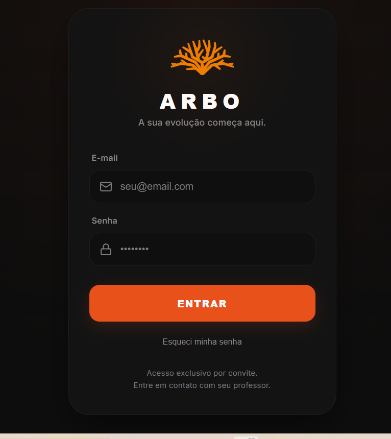
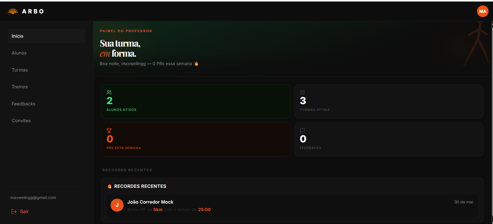
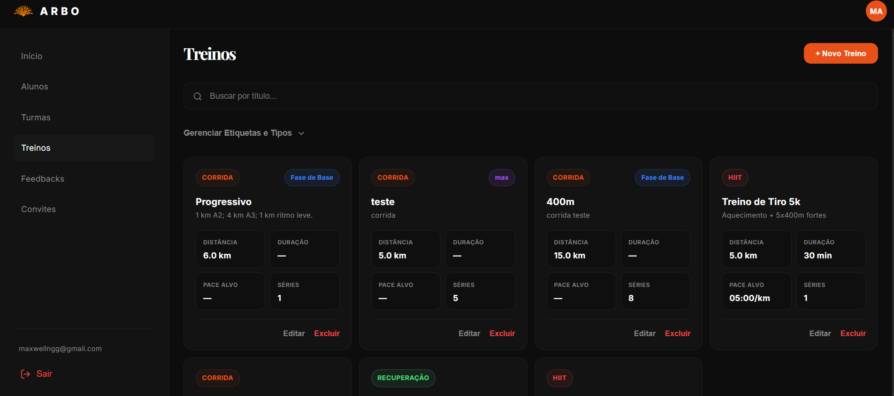

# 🌳 Arbo — Assessoria Esportiva de Corrida

[](https://github.com/maxwellnasci/arbo/actions/workflows/ci.yml)
[](https://arbo.mxos.com.br)
[](https://arbo.mxos.com.br)

> App de assessoria esportiva para corrida. Professor gerencia alunos, turmas e treinos digitalmente. Alunos acompanham evolução, batem recordes e se comunicam com o professor em tempo real.

## 🚀 App em produção

**https://arbo.mxos.com.br**

## 📱 Screenshots

| Login | Painel Admin | Biblioteca de Treinos |
|-------|-------------|----------------------|
|  |  |  |

## ✨ Funcionalidades

### Painel Admin (Professor)
- Gerenciamento de turmas e alunos
- Biblioteca de treinos com etiquetas personalizadas
- Plano mensal com grid de 4 semanas
- Controle de liberação semanal do plano
- Chat em tempo real com alunos
- Feed de recordes pessoais (PRs)
- Sistema de convites por email
- Exclusão segura de alunos

### App do Aluno
- Dashboard com treinos da semana
- Check-in de treinos realizados
- Progresso com gráfico de pace e streak semanal
- Recordes pessoais (5km, 10km, 21km, 42km)
- Chat direto com o professor
- Perfil com dados pessoais
- Instalável como PWA (Android + iOS)

## 🛠️ Stack

| Camada | Tecnologia |
|---|---|
| Frontend | React 19 + TypeScript + Vite |
| Backend | Supabase (banco, auth, RLS, Edge Functions) |
| Deploy | Vercel (CI/CD automático) |
| Email | Resend (smtp.resend.com) |
| PWA | vite-plugin-pwa + Workbox |
| Animações | framer-motion |
| Testes | Vitest |

## 📊 Qualidade (Lighthouse Mobile)

| Categoria | Score |
|---|---|
| Performance | 96 |
| Acessibilidade | 89 |
| Boas Práticas | 100 |
| SEO | 100 |

## 🏃 Como rodar localmente

### Pré-requisitos
- Node.js 22+
- Conta no Supabase

### Instalação

```bash
git clone https://github.com/maxwellnasci/arbo.git
cd arbo
npm install
```

### Variáveis de ambiente

Criar arquivo `.env.local`:

```
VITE_SUPABASE_URL=sua_url_do_supabase
VITE_SUPABASE_ANON_KEY=sua_chave_anonima
```

### Rodar

```bash
npm run dev
```

### Testes

```bash
npm test
```

### Build

```bash
npm run build
```

## 🔒 Segurança

- RLS habilitado em todas as tabelas
- Autenticação via Supabase Auth
- Edge Functions com validação JWT
- CSP headers configurados no Vercel
- CORS com allowlist explícita

## 📁 Estrutura do projeto

```
arbo/
  src/
    components/     # Componentes reutilizáveis
    contexts/       # AuthContext
    hooks/          # Hooks de dados
    lib/            # Tipos, utils, cliente Supabase
    pages/          # Páginas admin e aluno
  supabase/
    functions/      # Edge Functions
    migrations/     # Migrations SQL
  public/
    icons/          # Ícones PWA
    offline.html    # Página offline
```

## 👤 Sobre o projeto

Desenvolvido por **Maxwell** — Consultor de automações de IA em Curitiba.

Este projeto foi construído utilizando um **time de IA orquestrado**:
- **Claude** — estratégia, arquitetura e revisão
- **Gemini** — implementação principal com subagentes paralelos
- **DeepSeek** — análise técnica e cálculos matemáticos

O resultado: app completo do zero ao ar em ~30 dias, com qualidade de código 8.75/10.
